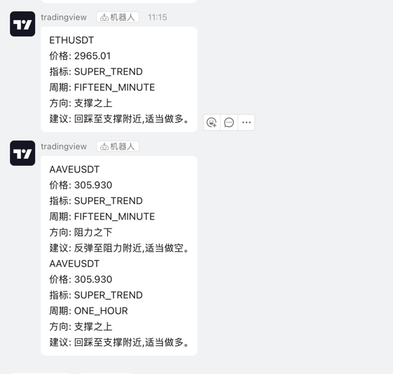

## 说明
此项目基于Java语言实现，借助Binance-api, 实现K线数据读取，并自动计算自选币种的指标信号。
用于辅助交易，根据指标发送信号通知，解放一部分盯盘的时间。

## 运行环境
- JDK 21
- Spring boot 3
- Redis
- MYSQL 目前未使用

## 关于指标
感谢 https://github.com/ethanimf/xianlaocai-quant 项目，集成了其分享的基础指标。
另外，借助AI几乎完全复刻了SuperTrend指标。

## 信号通知
### SuperTrend 信号通知
根据自选标的，自动计算其15min、1h、4h、1D四个周期的指标结果。根据订阅的ws数据，计算当前价格是否靠近支撑与阻力。若满足条件，则将信号发送至钉钉。实现的效果如下：


## 钉钉配置
此部分参考钉钉自定义机器人接入文档 https://open.dingtalk.com/document/robots/custom-robot-access

如果没有额外更改，只需修改application.yml文件中的CUSTOM_ROBOT_TOKEN、SECRET 即可。

## Redis
指标结果原计划放入内存，后来考虑了其他，最终决定放入Redis。自选数据也在Redis

## MySQL
当前未使用

## 如何使用
上述配置完成，项目正常启动后。需要先添加自选币种【限定币安U本位永续合约】，调用 /addOptionalSymbol 接口即可添加
比如添加 BTCUSDT，则 localhost:端口/addOptionalSymbol?symbol=BTC。

添加自选币种后，行情数据会自动拉取，并计算指标。若项目无报错，耐心等待信号通知即可

## 设置环境变量
以mac为例
1.打开配置文件
```shell
vim ~/.zshrc
```
2.输入配置信息
```shell
export BINANCE_TRADE_API_KEY=11
export BINANCE_TRADE_SECRET_KEY=22

export DINGDING_CUSTOM_ROBOT_TOKEN=33
export DINGDING_SECRET=44
```
3.加载环境变量
```shell
source ~/.zshrc
```

## 后续计划
 1. 识别单根K线形态

